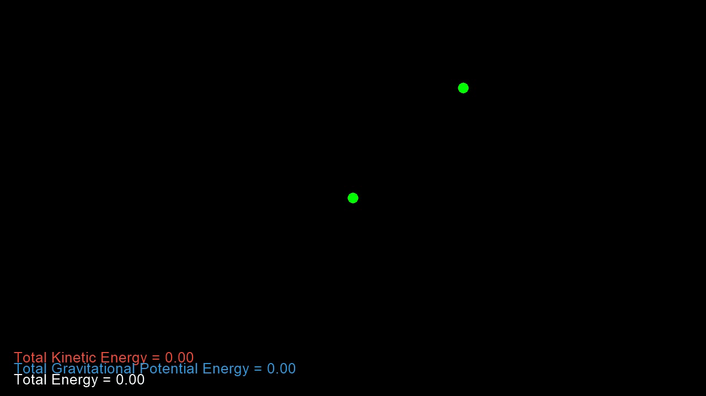

# Nosaj N-Body Simulator
by Jason Zhang (@Zjjc123) and Christine Ye (@Christine8888)

## Dependencies
- numpy
- pyglet
- matplotlib

## Renders
### Basic Two Body System With Energy Graph

## Developmental Update
Check out the Wiki for more progression [updates](https://github.com/Zjjc123/NosajSimulator/wiki/Updates)
